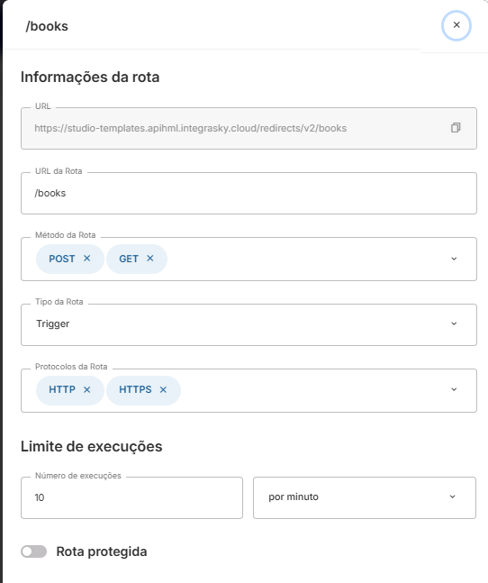

# Como usar OAuth2 com callback no Skyone Studio?

## O que é o fluxo Authorization Code?

O fluxo **Authorization Code** é o tipo de OAuth2 utilizado quando a autenticação exige a interação direta do usuário. O ciclo completo funciona da seguinte forma:

1. A plataforma A redireciona o usuário para a plataforma B, onde ele realiza o login
2. Após autenticar, a plataforma B redireciona o usuário de volta para a plataforma A usando uma **URL pré-cadastrada** (o callback/redirect URI), anexando um `code` temporário como parâmetro de query
3. A plataforma A usa esse `code` para fazer uma requisição à plataforma B, recebendo em troca os tokens de acesso (`access_token` e `refresh_token`)

Esse fluxo é comum em APIs públicas de plataformas consolidadas, quando **não é possível autenticar sem a interação do usuário** — o que o diferencia do fluxo **Client Credentials**, onde a autenticação é feita diretamente entre sistemas.

---

## Por que o Studio não possui um callback nativo?

O Skyone Studio não possui uma rota de callback pré-configurada. Para que uma conta funcione de forma autônoma e contínua, ela necessita **no mínimo do `refresh_token`** acessível para renovar o `access_token` automaticamente.

Por isso, é necessário obter os tokens antecipadamente, fora do fluxo padrão de criação de conta. Existem dois caminhos possíveis:

- **Usando o Skyone Studio** (API Gateway ou Webhook como receptor do callback)
- **Usando o Postman** (interceptando o callback localmente)

Opte pelo método que lhe for mais confortável.

---

## Fluxo usando o Skyone Studio

> Os exemplos a seguir usam o template de conector do Zoho Books. Consulte a documentação específica do conector para detalhes sobre nomes de operações, campos e comportamentos particulares.

### 1. Criar a URL de redirect no Studio

No Skyone Studio, acesse **API Gateway**, crie um Gateway e uma rota **sem autenticação**. Essa rota será a sua `redirect_uri`.

![[conta-books-default.png]]

Para visualizar a URL completa gerada, clique em **Editar a rota** depois de criá-la.

Por outro lado, você pode usar um **Webhook** do Studio como receptor. O princípio é o mesmo: qualquer URL acessível publicamente que aceite uma requisição GET com um parâmetro de query pode funcionar como redirect URI, para isso, insira num fluxo o gatilho de **Webhook** e guarde a sua URL.

### 2. Registrar a redirect URI na plataforma de destino

Essa etapa varia de acordo com a plataforma, consiste em, ao configurar a integração e receber o **Client ID** e **Client Secret**, registrar uma URL que pode ser usada como redirecionamento ou callback, inclua a URL criada no passo anterior.

### 3. Criar a conta conectada no Studio

No conector da plataforma alvo, crie uma **conta conectada** preenchendo os campos disponíveis (Host, Porta, Client ID, Client Secret, endpoint de troca de token etc.), mas **deixe os campos de `access_token` e `refresh_token` vazios por enquanto**.



> Consulte a documentação do conector específico para saber quais campos são obrigatórios nessa etapa e quais valores utilizar.

### 4. Montar o fluxo de captura dos tokens

1. Crie uma **integração e um fluxo** no Studio

> Caso tenha criado um webhook, utilize o mesmo fluxo

2. Adicione um gatilho de **API Gateway** e selecione o gateway e a rota criados no passo 1 (desnecessário caso tenha criado com webhook)
3. No gatilho, adicione um **parâmetro de query** com o nome `code`
4. Adicione o módulo do conector da plataforma alvo e escolha a operação de **obtenção do Access Token** (o nome exato varia por conector; consulte a documentação específica)
5. Nos parâmetros da operação, preencha o **Client ID**, o **Client Secret** e a **redirect URI**; para o campo `code`, arraste o parâmetro de query criado no gatilho
6. **Ative o fluxo**

### 5. Realizar a autenticação

Acesse a URL de autenticação da plataforma no seu navegador. Cada plataforma possui uma URL própria, como essa:

```
https://{URL}/auth?scope={scopes}&client_id={client_id}&response_type=code&access_type=offline&redirect_uri={redirect_uri}
```

Onde:

- `{plataforma}` — domínio específico da plataforma (ex: `zoho`, `xero` etc.)
- `{scopes}` — permissões que os tokens devem ter; consulte a documentação da plataforma para os valores corretos
- `{client_id}` — o Client ID registrado no passo 2
- `{redirect_uri}` — a URL do gatilho criado no passo 1

Ao fazer login e autorizar o aplicativo, você será redirecionado para a sua rota do Studio. O fluxo será executado automaticamente.

### 6. Recuperar os tokens nos logs

Volte ao fluxo no Studio e acesse os **logs da última execução**. Na execução do módulo de obtenção do token, você verá o `access_token` e o `refresh_token` retornados pela plataforma.

> Caso o `refresh_token` não apareça no log, verifique se o parâmetro correto para emissão offline foi incluído na URL de autenticação (passo 5).


### 7. Atualizar a conta conectada

Com os tokens em mãos, volte à conta conectada criada no passo 3 e preencha os campos de `access_token` e `refresh_token`.

> Algumas plataformas exigem configurações adicionais na conta após esse passo, como marcar uma opção de envio de parâmetros via query string ou adicionar headers específicos. Consulte a documentação do conector específico.

> Após concluir, caso necessário, considere **desativar ou excluir o fluxo de captura** para evitar que os tokens fiquem expostos nos logs de futuras execuções.

---

## Fluxo usando o Postman

[!!!]

---

## Considerações gerais

- O `access_token` tem validade curta (geralmente minutos ou horas). O Studio utiliza o `refresh_token` para renová-lo automaticamente — por isso ele é indispensável.
- O `refresh_token` pode ter validade longa ou indefinida, mas **pode ser invalidado** se o usuário revogar o acesso ou se o app ficar inativo por muito tempo. Nesse caso, o processo de obtenção dos tokens deve ser repetido.
- Plataformas diferentes usam **escopos com sintaxes distintas** (separados por espaço, vírgula ou em formato hierárquico). Consulte a documentação oficial da plataforma para montar a lista correta.
- O **Client ID e Client Secret nunca devem ser compartilhados** fora do ambiente de configuração do conector.
